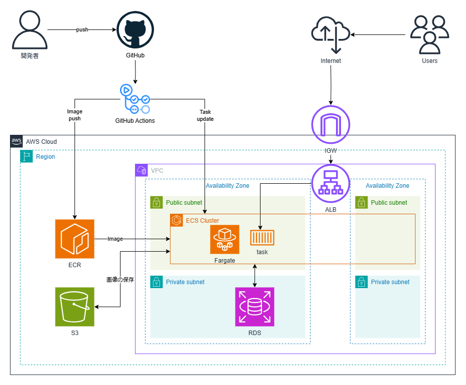

# Reptalicious EC Site

このWebアプリは、SpringBootで開発したECサイトです。  
AWS環境にデプロイし、GitHub Actionsを活用してCI/CDを自動化しています。

### AWS構成図

## 環境変数の設定（GitHub Repository Secrets）

以下の環境変数をGitHubのRepository Secretsに設定してください。

| 変数名               | 説明                     |
|---------------------|------------------------|
| AWS_ACCESS_KEY_ID  | AWSのアクセスキー       |
| AWS_SECRET_ACCESS_KEY | AWSのシークレットアクセスキー |
| AWS_REGION        | AWSのリージョン          |
| DB_USERNAME       | RDSのユーザー名          |
| DB_PASSWORD       | RDSのパスワード          |
| AWS_S3_BUCKET     | S3のバケット名           |

## GitHub Actions のワークフロー実行

### 環境構築（setup.yml）
[setup.yml](.github/workflows/setup.yml) ではCloudFormationを使用してAWS環境を構築し、SpringBootアプリをデプロイします。

1. GitHub Actionsのワークフロー`setup.yml`を手動で実行します。
2. ワークフローが完了したら、ALBのDNS名にアクセスし、アプリが正しく動作していることを確認してください。

---

## 初期ログイン情報

デフォルトのログイン情報は以下の通りです。

| 権限  | メールアドレス            | パスワード  |
|------|----------------------|-----------|
| 管理者 | admin01@example.jp  | password  |
| 一般   | user**@example.jp  | password  |

※ `**` には `01~09` のいずれかの数字が入ります。

:::note warn
アプリの動作を確認後、`application.properties` の   
`spring.jpa.hibernate.ddl-auto=create` を `spring.jpa.hibernate.ddl-auto=update` に変更してください。
:::

---

## ソースコードの変更とデプロイ

[deploy.yml](.github/workflows/deploy.yml) は、アプリの `src` フォルダの変更が `push` されたことをトリガーにして、ワークフローが実行されます。

1. ソースコードを変更し、GitHubへ `push` します。
2. `deploy.yml` のワークフローが自動的に実行されます。
3. ワークフロー完了後、アプリが正常に動作し、変更が反映されていることを確認してください。

---

以上でセットアップは完了です。

